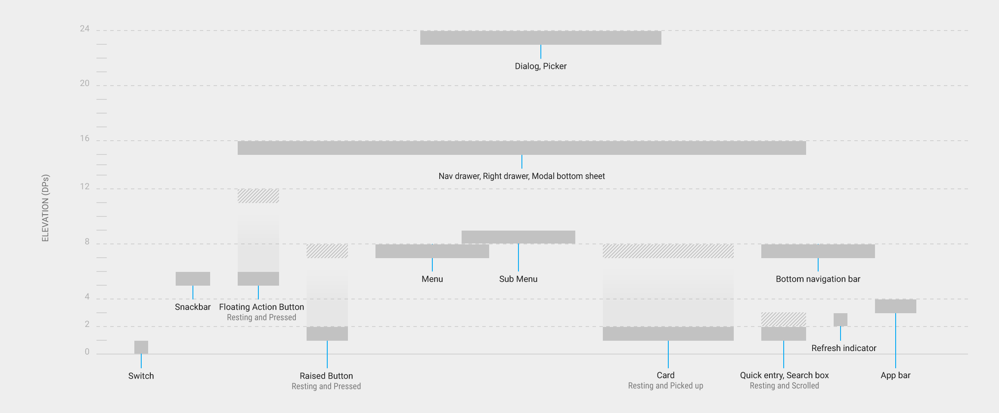
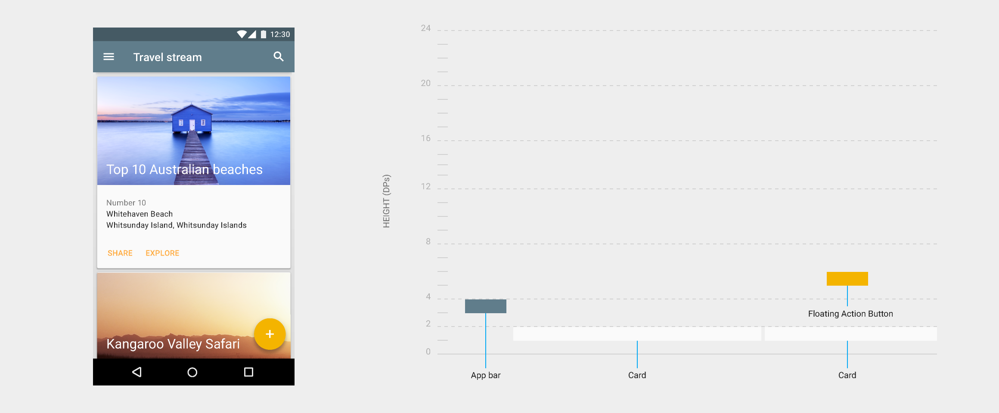

<h1 id="envir" style="color:#00bcd4;margin: 0">高度与阴影</h1>

<blockquote style="color:#00bcd4;border-left: 4px solid #00bcd4;margin: 30px 0;">

material design中的对象具有和现实世界中相同的特质

</blockquote>

在现实世界中，不同对象可以相互堆叠或粘贴，但不能相互贯穿。对象可以投射阴影同时也可反射光线。

Material Design 通过创造一个用户熟悉的空间模型来展示这些特性，并始终如一地应用于移动应用当中。

<h4 style="color:#00bcd4">高度</h4>

高度是指表面之间的距离和其阴影的深度,它衡量的是一个材质的上表面与另一个材质的上表面之间的垂直距离。

<h4 style="color:#00bcd4">静态高度</h4>

所有材质都具有静态高度（未具交互状态时的初始高度）。尽管组件在程序之间有着相同的静态高度，然而不同设备和平台间可能具有不同的静态高度。

<h4 style="color:#00bcd4">动态高度偏移</h4>

动态高度偏移是组件相对于静态状态移动的目标高度。

<blockquote style="color:#00bcd4;border-left: 4px solid #00bcd4;margin: 30px 0;">

内容

<h4><a href="#elevation">高度</a></h4>
<h4><a href="#shadow">阴影</a></h4>
<h4><a href="#OBrelationship">对象关系</a></h4>
</blockquote>

<h2 id="elevation" style="color:#00bcd4;">高度</h2>

高度是指材质间的相对纵深，即沿z轴方向两表面间的距离

<h4 style="color:#00bcd4">说明：</h4>

* 高度是以与x轴，y轴相同单位进行测量的，通常是指density independent pixels(密度独立像素)。因为所有材质元素的厚度为1dp，而高度是指从一个材质的上表面到另一个材质上表面的距离。

* 一个子对象的高度和其父对象的高度相关

该图反映了两个材质间的多倍高度

<h4 style="color:#00bcd4">静态高度</h4>

所有材质对象不论大小都具有一个静态高度，或者称之为“默认高度”。静态高度不会发生改变。当材质对象高度发生改变，应该尽快恢复到原先的静态高度。

	<table class="s-tag-table">
		<tbody>
		<tr><td colspan="1" rowspan="1">
Elevation (dp)
</td><td colspan="1" rowspan="1">
Component
</td></tr>
		<tr><td colspan="1" rowspan="1">
24
</td><td colspan="1" rowspan="1">
Dialog

Picker
</td></tr>
		<tr><td colspan="1" rowspan="1">
16
</td><td colspan="1" rowspan="1">
Nav drawer 

Right drawer

Modal bottom Sheet
</td></tr>
		<tr><td colspan="1" rowspan="1">
12
</td><td colspan="1" rowspan="1">
Floating action button (FAB - pressed)
</td></tr>
		<tr><td colspan="1" rowspan="1">
9
</td><td colspan="1" rowspan="1">
Sub menu (+1dp for each sub menu)
</td></tr>
		<tr><td colspan="1" rowspan="1">
8
</td><td colspan="1" rowspan="1">
Bottom navigation bar

Menu

Card (when picked up) 

Raised button (pressed state)
</td></tr>
		<tr><td colspan="1" rowspan="1">
6
</td><td colspan="1" rowspan="1">
Floating action button (FAB - resting elevation)

Snackbar
</td></tr>
		<tr><td colspan="1" rowspan="1">
4
</td><td colspan="1" rowspan="1">
App Bar
</td></tr>
		<tr><td colspan="1" rowspan="1">
3
</td><td colspan="1" rowspan="1">
Refresh indicator

Quick entry / Search bar (scrolled state)
</td></tr>
		<tr><td colspan="1" rowspan="1">
2
</td><td colspan="1" rowspan="1">
Card (resting elevation) *

Raised button (resting elevation)*

Quick entry / Search bar (resting elevation)
</td></tr>
		<tr><td colspan="1" rowspan="1">
1
</td><td colspan="1" rowspan="1">
Switch
</td></tr>
		</tbody>
	</table>

<h4 style="color:#00bcd4">组件高度</h4>

一种组件的静态高度在同一平台的所有app中保持一致。例如，在不同应用中浮动操作按钮的高度是不会发生改变的。

组件可能在不同平台中会有不同的静态高度，这取决于所处环境的深度。例如，电视比台式电脑的深度更深是由于电视拥有更大的屏幕并且它是从更远的距离进行观看。同理，电视和台式机的深度也要大于手机。

<h4 style="color:#00bcd4">响应高度和动态高度偏移</h4>

有些组件也具有响应高度，这意味着它们会响应用户输入（默认状态，获取焦点，按压操作）或系统事件而改变其高度。这类高度的改变始终通过动态高度偏移来实现。

动态高度偏移是组件相对于静止状态移动的目标高度。动态高度偏移确保了当组件行为和类型发生改变时高度变化能保持一致。例如, 所有组件被按压后升起时应保持相同的高度变化相对其静态时的高度。

当输入事件完成或被取消时，组件应该恢复到它的静态高度。

<h4 style="color:#00bcd4">避免高度间相互干扰</h4>

具有响应高度的组件可能会在其静止高度和动态高度偏移之间移动时遇到其它组件。由于材质间不可相互穿越，因此不论是在基于单个组件还是使用整个应用的布局时应该避免任何形式的干扰。

在组件层面上，组件可以在其导致干扰之间移动或移除。例如，一个浮动操作按钮可以在用户选择一个卡片时消失或移除屏幕，或是移动到snackbar上。

在整体布局层面上，在设计应用时应该尽量减少干扰的机会。例如将浮动操作按钮放置在一连串卡片的一侧，这样的话当用户选择一张卡片时，按钮就不会受到干扰。

<h4 style="color:#00bcd4">组件高度对比</h4>

下图展示了组件静态高度和动态高度偏移

该图显示了一个拥有卡片和浮动操作按钮的应用布局，以及沿其z轴的组件高度的横截面

该图显示了一个具有抽屉导航的应用布局，以及沿其z轴的组件高度横截面

<h2 id="shadow" style="color:#00bcd4;">阴影</h2>

阴影提供了关于物体深度和运动方向的重要视觉线索。它们是表明对象表面之间的间距值的唯一视觉线索。一个对象的高度决定了其阴影如何呈现。

<section style="margin-bottom: 30px">
<figure style="width: 30%;float: left;margin-right: 20px;">
	

	<figcaption style="border-top:15px solid #d32f2f;padding: 10px;margin-top:10px">
	
错误

	
如果没有阴影，就无法表明浮动操作按钮是与背景表面相分离的

	</figcaption>
</figure>
<figure style="width: 30%;float: left;margin-right: 20px;">
	

	<figcaption style="border-top:15px solid #d32f2f;padding: 10px;margin-top:10px">
	
错误

	
清晰且生硬的阴影表面按钮与蓝色色块是相分离的元素。但是，它们的阴影过于接近以至于会认为按钮和色块处于同一的高度。

	</figcaption>
</figure>
<figure style="width: 30%;float: left;margin-right: 20px;">
	

	<figcaption style="border-top:15px solid #4caf50;padding: 10px;margin-top:10px">
	
正确

	
柔和且较大的阴影表明浮动按钮比蓝色色块具有更高的高度

	</figcaption>
</figure>

</section>

在运动中，阴影也提供了关于对象运动方向的有用线索，同时能反映出物体表面间的距离是增加或是减少。

<section style="margin-bottom: 30px">
<figure style="width: 30%;float: left;margin-right: 20px;">
	

	<figcaption style="border-top:15px solid #d32f2f;padding: 10px;margin-top:10px">
	
错误

	
没有阴影表示高度，我们无法获知当前矩形是大小尺寸增加还是高度增加。

	</figcaption>
</figure>
<figure style="width: 30%;float: left;margin-right: 20px;">
	

	<figcaption style="border-top:15px solid #4caf50;padding: 10px;margin-top:10px">
	
正确

	
当物体的高度增加时其阴影会变得更大更柔和，反之阴影将会变小且清晰生硬。

	</figcaption>
</figure>
<figure style="width: 30%;float: left;margin-right: 20px;">
	

	<figcaption style="border-top:15px solid #4caf50;padding: 10px;margin-top:10px">
	
正确

	
在这种情况下，一致的阴影帮助用户了解当前对象是形状发生变化而非高度改变。

	</figcaption>
</figure>

</section>

<h4 style="color:#00bcd4">元素参考阴影</h4>
<!-- app bar-->
<section style="margin-bottom: 30px">

	
<strong>应用bar</strong>

	
4dp

<figure style="width: 75%;float: left;">
	

</figure>

</section>
<!-- Raised button-->
<section style="margin-bottom: 30px">

	
<strong>浮雕按钮</strong>

	
静态：2dp

	
点击：8dp

	
对于桌面程序

	
静态：0dp

	
点击：2dp

<figure style="width: 75%;float: left;">
	

</figure>

</section>
<!-- FAB-->
<section style="margin-bottom: 30px">

	
<strong>浮动操作按钮 </strong>

	
静态：6dp

	
点击：12dp

<figure style="width: 75%;float: left;">
	

</figure>

</section>

