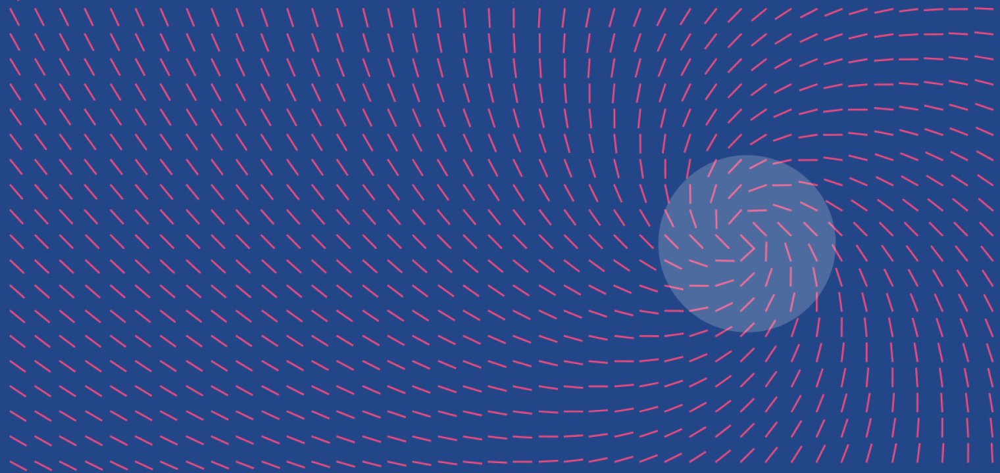
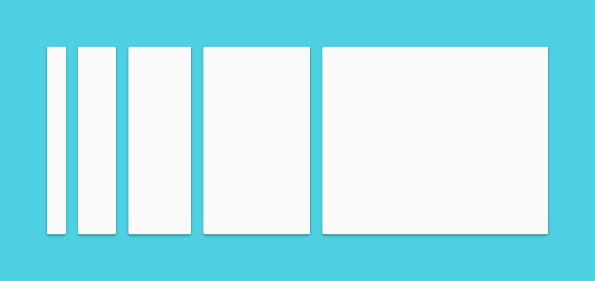
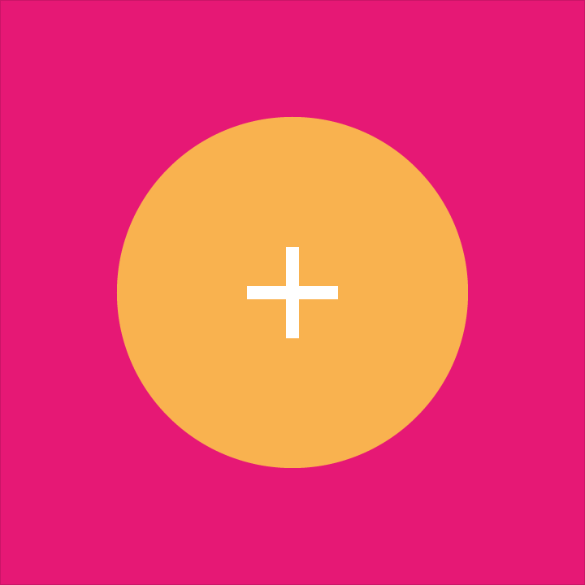

<h1 id="envir" style="color:#00bcd4;margin: 0">Material Design (质感设计) 介绍</h1>

我们挑战自我，为用户创造了一套综合传统经典设计理论与创新科技于一身的设计语言。Material Design, 中文称为质感设计。

<blockquote style="color:#00bcd4;border-left: 4px solid #00bcd4;margin: 30px 0;">

内容

<h4><a href="#aim">目标</a></h4>
<h4><a href="#principle">设计原则</a></h4>
</blockquote>

<h2 id="aim" style="color:#00bcd4;">目标</h2>

希冀创造出一套将经典的设计原则与创新科技理念融于一身的设计语言

希冀开发一套独一的底层系统，在此系统上构建跨平台和超越设备尺寸大小的统一用户体验。遵循基本的移动设计原则，同时触摸，语音，鼠标，键盘也要作为优先考虑的输入方式。

<h2 id="principle" style="color:#00bcd4;">设计原则</h2>

<blockquote style="color:#00bcd4;border-left: 4px solid #00bcd4;margin: 30px 0;">质感隐喻</blockquote>

质感隐喻是对空间合理利用及运动系统化的统一结合。质感是感触实物的基础，Material Design的灵感来源于对传统的纸张和油墨的认知，同时凭借先进技术不断引入天马行空的新奇构思。

材质（material）的表面和边缘为感知现实世界提供了视觉线索，与现实世界中相似的[触觉特性](http://staff.pccu.edu.tw/~tdl/percep12.html "唐大仑 知觉心理学")帮助用户可以快速的理解和感知。而材质的多样化（灵活性）为用户创造了新颖而个性的触觉感受，又不会脱离现实世界的物理规则。

光线，物体表面的变化及其运动的基本原理是表达物体如何运动，交互方式，空间关系的关键。真实的光效可以展示出物体之间的相互关系，分离关系和如何运动。

<blockquote style="color:#00bcd4;border-left: 4px solid #00bcd4;margin: 30px 0;">鲜明，形象，目标导向设计</blockquote>

设计语言借鉴了传统印刷设计中的基本元素，排版，网格，留白，尺寸，色彩，图片等来规范视觉处理。这些元素不仅仅是为了愉悦观感，关键是这些元素可以帮助我们创建出视觉层级，视觉语义和视觉焦点。通过色彩的精心选择，使用规整的图片，醒目的字体及有目的的留白，我们帮助用户创造出一套鲜明的视觉界面带给其愉悦的体验。

Material Design 强调在用户操作过程中核心功能需要立即展现，并为用户提供操作锚点（操作轨迹或导航路径）

<blockquote style="color:#00bcd4;border-left: 4px solid #00bcd4;margin: 30px 0;">有意义的动效</blockquote>

动效重视并强调将用户作为原动力，主要的用户操作应作为开始动效和转变整体设计的转折点。

所用的动效应发生在单一的情景中。物体的呈现不应打断用户连续性的体验，即使其形态发生改变或重新组织。

动效应该是有意义且恰当的，其目的是为了引起注意并维持系统的连续性体验。动效的反馈应保持精细且清晰（不易太过生硬显著），转场动效应保持高效且连贯。

<h5><a href="#envir" style="position:fixed;right:120px;bottom:30px;">回到顶部</a></h5>

